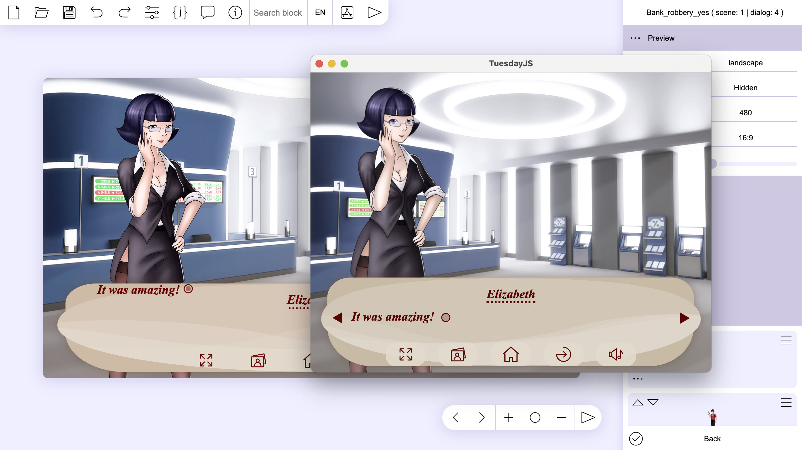
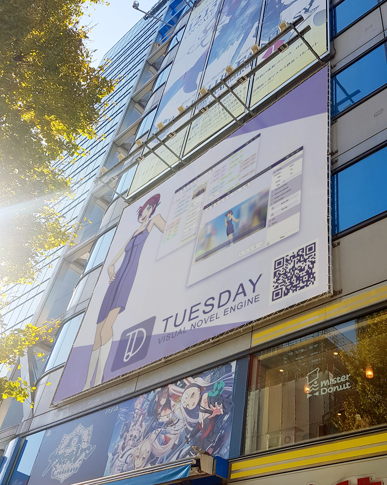

# Tuesday JS
is a free open source engine to creating visual novels, interactive fiction and text-based adventure games. Written in JavaScript without using any third party libraries. The projects can be exported to Apache Cordova to create mobile applications or PC programs. The engine uses standard HTML document elements DOM such as div and img, this allows the use any media format supported by browsers, including vector graphics svg, gif animations and css styles.
The editor combines a drag and drop tool to create scenes and interfaces, as well as a visual scenario editor in form of flowcharts node, which displays all the plot elements and branching of the story. This makes it easier to navigate through the script and helps to create a large story with many plot options.

は、ビジュアルノベルやインタラクティブフィクション、テキストベースの冒険ゲームを作るためのオープンエンジンです。JavaScriptで書かれており、サードベンダーのライブラリは使われていません。pc用のモバイルアプリやプログラムを作る際の、Apache Cordovaフレームワークによるサポートがあります。エンジンには、divやimgのようなHTMLドキュメントの標準要素DOMを使用しており、ブラウザによってサポートされている、svgグラフィックやgifやcssスタイルのアニメを含む、任意のメディアフォーマットを使うことができます。

est un moteur open source gratuit pour créer des romans visuels, des histoires interactives et des jeux d'aventure basés sur du texte. Écrit en JavaScript, il n’utilise aucune bibliothèque tierce. Les projets peuvent être exportés vers Apache Cordova pour créer des applications mobiles ou des programmes PC. Le moteur utilise des éléments de document HTML standard DOM tels que div et img, ce qui permet d'utiliser tout format multimédia pris en charge par les navigateurs, y compris les graphiques vectoriels svg, les animations gif et les styles css.

es un motor gratuito y de código abierto para crear novelas visuales, historias interactivas y juegos de aventura basados en texto. El mismo está programado en JavaSript sin usar ninguna librería de terceros. Los proyectos pueden ser exportados a Apache Cordova para crear aplicaciones móviles o programas de PC. El motor utiliza el estándar HTML de documentos DOM como div e img, lo que le permite utilizar cualquier tipo de formato multimedia soportado por los navegadores, incluyendo gráficos vectoriales svg, animaciones gifs y estilos css.

бесплатный движок с открытым исходным кодом для создания визуальных новелл, интерактивных историй и текстовых приключенческих игр. Написано на JavaScript без использования сторонних библиотек. Проэкт возможно экспортировать в Apache Cordova для создания мобильных приложений или программ для ПК. Движок использует стандартные элементы DOM документа HTML, такие как div и img, что позволяет использовать практически любой медиаформат, поддерживаемый браузерами, включая векторную графику svg, анимацию gif и стили css.

Home Page: https://kirilllive.github.io/tuesday-js/

Steam: https://store.steampowered.com/app/1575970/Tuesday_JS_visual_novel_engine/

itch.io: https://kirill-live.itch.io/tuesday-js

Twitter: https://twitter.com/TuesdayJS_vn

Patreon: https://www.patreon.com/kirill_live

# Visual editor

visual editor for web browser https://kirilllive.github.io/tuesday-js/tuesday_visual.html

The visual editor allows you to create graphics or kinetic novels without any programming knowledge.
If is necessary, it is possible to expand the basic functionality using JavaScript and css.

ビジュアルエディターはグラフィックもしくはキネティックノベルを、プログラミングの知識なしで作ることができます。
必要であれば、JavaScriptやcssを使って、基本機能を拡大することができます。

L'éditeur visuel vous permet de créer des graphiques ou des romans dynamiques sans aucune connaissance en programmation.
Vous avez ensuite toute latitude, si nécessaire, d'étendre les fonctionnalités de base en utilisant JavaScript et css.

El editor te permite crear gráficos o novelas cinéticas sin tener ningún conocimiento de programación.
También es posible expandir las funcionalidades básicas usando JavaScript y css.

Визуальный редактор позволяет создавать графический или кинетический роман без знания программирования.
При необходимости возможно расширение базового функционала с помощью JavaScript и css.

# Visualization
The editor fully displays the structure of the script with all elements, build branching narrative and dialogue. such as dialog options and selection consequences. This makes it easier to navigate and edit the script.

エディターは、会話オプションや選択肢のような全ての要素を伴うスクリプトの構造を完全に映し出します。これにより、ナビやスクリプトを編集しやすくします。

L'éditeur affiche entièrement la structure du scénario avec tous les éléments tels que les options de dialogue et les conséquences des réponses choisies. La navigation et la modification du scénario en est ainsi facilité.

El editor muestra la estructura completa del script con todos sus elementos, como diálogos con diferentes opciones y las consecuencias de dichas opciones. Esto hace que sea más fácil navegar por el proyecto y editar el script.

Редактор полностью отображает структуру сценария со всеми элементами, выстраивает разветвленное повествование и диалоги. такие как параметры диалога и последствия выбора. Это упрощает навигацию и редактирование сценария.


# Scene editor
The scene editor can not only arrange all the elements in their places, it also shows how the scene will change on different screens. 
In your scene layout, you can use standard HTML units in percentage pixels or centimeters to better adapt the scene to different screens.

は、すべての要素をその場所に配置できるだけでなく、さまざまな画面でシーンがどのように変化するかを示します。 
シーンレイアウトでは、パーセンテージピクセルまたはセンチメートル単位の標準HTML単位を使用して、シーンをさまざまな画面により適切に適合させることができます。

L'éditeur de scène peut non seulement organiser tous les éléments à leur place, mais il montre également comment la scène changera sur différents écrans. 
Dans la mise en page de votre scène, vous pouvez utiliser des unités HTML standard en pourcentage de pixels ou en centimètres pour mieux adapter la scène à différents écrans.

El editor de escenas no solo puede organizar todos los elementos en sus lugares, sino que también muestra cómo cambiará la escena en diferentes pantallas. 
En el diseño de su escena, puede usar unidades HTML estándar en porcentaje de píxeles o centímetros para adaptar mejor la escena a diferentes pantallas.

Редактор сцены может не только расставить все элементы на своих местах, он также показывает, как сцена будет меняться на разных экранах. 
В макете сцены вы можете использовать стандартные единицы HTML в процентах пикселей или сантиметрах, чтобы лучше адаптировать сцену к разным экранам.
	


# Localization
Ample opportunities to localize stories into other languages.
You can set the translation for almost any element of your project, such as text and graphics.
The preview function allows you to run the project in the selected language.
All texts can be exported to a table csv file for editing and adding localizations in another editor.

他言語にストーリーをローカリゼーションできる広い可能性。
テキストやグラフィックのような、プロジェクトの任意の要素を翻訳できます。
プレビュー機能により、選択した言語でプロジェクトを運営することができます。
すべてのテキストは、編集や他の版にローカリゼーションしたものを加えることができるよう、table csv fileに書き出されます。

De nombreuses options permettent d'adapter les histoires dans d'autres langues. 
Vous pouvez définir la traduction de presque tous les éléments de votre projet, tels que le texte et les graphiques. 
La fonction d'aperçu vous permet d'exécuter le projet dans la langue sélectionnée. 
Tous les textes peuvent être exportés vers un fichier csv pour édition et ajout de localisations dans un autre éditeur, tel qu'un tableur.

Amplias oportunidades para localizar historias a otros lenguajes. 
Puedes seleccionar traducciones para prácticamente todos los elementos de tu proyecto, ya sean textos o gráficos. 
La función de vista previa te permite probar tu proyecto en el lenguaje seleccionado. 
Todos los textos pueden ser exportados a un archivo csv para editarlo y añadir las localizaciones en otro editor.

Широкие возможности для локализации истории на другие языки.
Вы можете задать перевод практически для любого элемента проекта, как текст и графика.
Функция предварительного просмотра позволяет запускать проект на выбранном языке.
Все тексты можно экспортировать в табличный файл csv для редактирования и добавления локализации в другом редакторе.


# JSON
A story script with all the elements stored in a JSON structure. Almost any programming language can work with this format. This allows you to port your script to another engine or platform.
The editor has a built-in tool to work with JSON, with its help you can edit the entire contents of the script or just the selected element.

すべての要素を含むスクリプトはJSON形式で保存されます。この形式で、ほとんどのプログラミングげんごが使えます。これにより、あなたのスクリプトを、他のエンジンやプラットフォームに移すことができます。
エディターにはJSONで作業するための埋め込みツールがあり、スクリプトのすべてのコンテンツや選択した要素を編集することができます。

Tous les éléments du scénario sont stockés dans une structure JSON, un format universel lisible par la quasi totalité des langages de programmation. Vous pouvez ainsi porter votre scénario sur un autre moteur ou une autre plateforme. 
L'éditeur dispose d'un outil intégré pour travailler la structure JSON qui vous permet de modifier l'intégralité du scénario ou uniquement un élément spécifique.

El script con todos sus elementos es guardado en una estructura JSON. Prácticamente cualquier lenguaje de programación puede trabajar con este formato. Esto te permite exportar tu script a cualquier otro motor o plataforma. 
El editor tiene una herramienta incorporada para trabajar con JSON, con la misma puedes editar todo el contenido del script o simplemente un elemento seleccionado.

Сценарий истории со всеми элементами, хранящимися в структуре JSON. С этим форматом может работать практически любой язык программирования. Это позволяет вам перенести ваш сценарий на другой движок или платформу. 
В редакторе есть встроеный инструмент для работы с JSON, с его помощью вы можете редактировать все содержимое сценария или только выбранный элемент.
	


# Preview
Preview allows you to start a project from a certain point in the script and with the selected localization.

プレビューにより、スクリプトの特定の部分や選択したローカライゼーションでプロジェクトを始めることができます。

L'aperçu vous permet de démarrer un projet à partir de n'importe quel point du scénario et avec la localisation sélectionnée.

La función de vista previa te permite iniciar tu proyecto desde cierto punto en el script y con la localización seleccionada.

Предварительный просмотр позволяет запускать проект с определенного места сценария и с выбранной локализацией.




# Tutorial for Visual Editor

Tutorial for creating visual novels: https://kirilllive.github.io/tuesday-js/tutorial.html


# Tutorial for RunTime

step 1
The engine file "tuesday.js" downloaded from https://kirilllive.github.io/tuesday-js/tuesday.js

step 2
Index.html file with id = 'tuesday' elements to display the novel
```html
<html>
    <head>
    </head>
    <!--After loading, the load_story function is launched, indicating a file or array with history-->
    <body onload="load_story('file','story.json')">
        <!--display area-->
        <div id='tuesday' style='width:100%; height:90vh;'></div>
        <!--path to the engine file, always at the end of the page-->
        <script type="text/javascript" src="tuesday.js"></script>
    </body>
</html>
```

step 3
Create a story file story.json
```json
{
    "parameters": {
        "text_panel": {
            "size": ["95%","25%"],
            "color": "#9cf",
            "indent_bottom": "32px",
            "size_text": "20px",
            "dialog_speed": 20
        },
        "name_panel": {
            "size": ["0","48px"],
            "position": ["0","0","-48px","0"],
            "size_text": "18px"
        },
        "launch_story": "main_menu",
        "languares": ["en"],
        "buttons": [
            {
                "name": "tue_back",
                "position": ["0","55%","0","8px"],
                "size": ["52px","52px"],
                "color": "#888",
                "size_text": "48px",
                "text":"<"
            },{
                "name": "tue_next",
                "position": ["55%","0","0","8px"],
                "size": ["52px","52px"],
                "color": "#888",
                "size_text": "48px",
                "text":">"
            }
        ]
    },
    "main_menu":[
        {
            "dialogs":[
                {
                    "choice":[
						{
                            "go_to": "story",
                            "position": ["50%","0","0","50%"],
                            "size": ["128px","48px"],
                            "color": "#888",
                            "color_text": "#fff",
                            "text": "Start"
                        }
                    ]
                }
            ]
        }
    ],
    "story": [
        {
            "dialogs":[
                {
                    "back_to": "main_menu",
					"text":"1234567890",
                    "name":"numbers"
                },{
					"go_to": "main_menu",
					"text":"ABCDEFZHIKLMNOPQRSTVX",
                    "name":"letters"
                }
            ]
        }
    ]
}
```

Possible startup problems RunTime и устройстве сценария в JSON 

Index.html file with id = 'tuesday' elements to display the novel
```html
<html>
    <head>
    </head>
    <!--Change load_story value from ('file', 'story.json') to ('data', story) -->
    <body onload="load_story('data',story)">
    <div id='tuesday' style='width:100%; height:90vh;'></div>
        <!-- Add script tag before tuesday.js --> ;
        <script>
            let story = <!--insert content from story.json --> ;
        </script>
        <script type="text/javascript" src="tuesday.js"></script>
    </body>
</html>
```

More information about RunTime and JSON script  you can be found in

documentation: https://kirilllive.github.io/tuesday-js/tuesday_doc.html




The goal of Tuesday JS is to make project development no more difficult than working in an office program to make presentations, and does not require special skills from the user.
