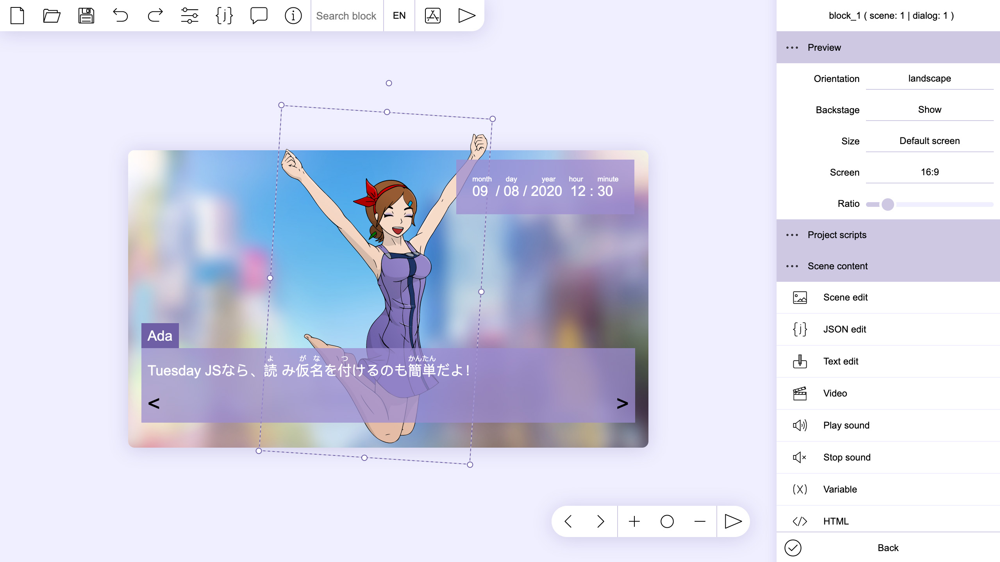
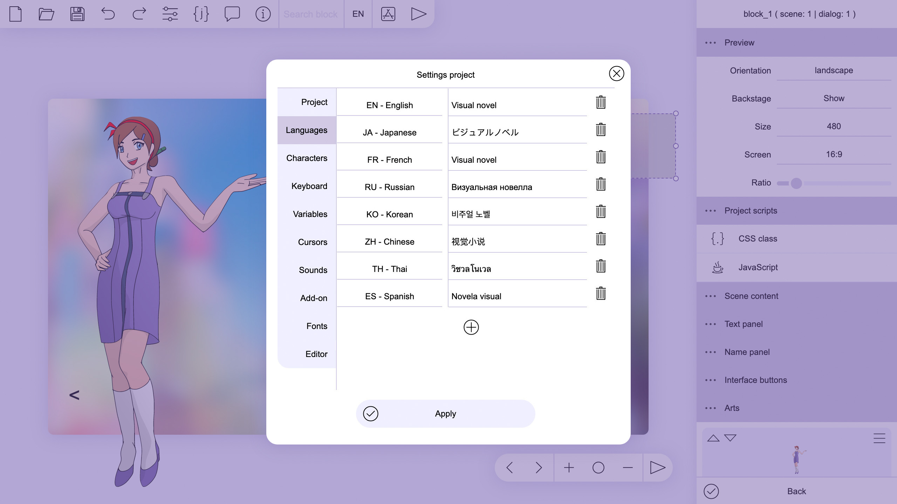

# Tuesday JS web visual novel engine 
is a simple web-based, free and open-source visual novel editor that can be used in a web browser. It is written in JavaScript without using any third party libraries and thus does not require additional software installation. The engine uses standard HTML document elements such as div and img. This allows the use of any media format supported by browsers including vector graphics svg, gif animations and css styles.
The editor is designed to create interactive fiction, graphic or kinetic novels without knowledge of programming languages. It uses a drag and drop interface for scene editing and to make interfaces. The story script is displayed as a flowchart node with all plot elements and branches. This makes it easier to navigate and helps you create a great story with many plot options.
There is a version of the editor available as a standalone application for Android devices and desktops. All versions are fully compatible with each other and have the same interface.

は、ビジュアルノベルやインタラクティブフィクション、テキストベースの冒険ゲームを作るためのオープンエンジンです。JavaScriptで書かれており、サードベンダーのライブラリは使われていません。pc用のモバイルアプリやプログラムを作る際の、Apache Cordovaフレームワークによるサポートがあります。エンジンには、divやimgのようなHTMLドキュメントの標準要素DOMを使用しており、ブラウザによってサポートされている、svgグラフィックやgifやcssスタイルのアニメを含む、任意のメディアフォーマットを使うことができます。

Est un moteur open source gratuit pour créer des romans visuels, des histoires interactives et des jeux d'aventure basés sur du texte. Écrit en JavaScript, il n’utilise aucune bibliothèque tierce. Les projets peuvent être exportés vers Apache Cordova pour créer des applications mobiles ou des programmes PC. Le moteur utilise des éléments de document HTML standard DOM tels que div et img, ce qui permet d'utiliser tout format multimédia pris en charge par les navigateurs, y compris les graphiques vectoriels svg, les animations gif et les styles css.

Home Page: https://kirilllive.github.io/tuesday-js/

Steam: https://store.steampowered.com/app/1575970/Tuesday_JS_visual_novel_engine/

itch.io: https://kirill-live.itch.io/tuesday-js

Twitter: https://twitter.com/TuesdayJS_vn

[](https://ko-fi.com/E1E54DM6V)

[](https://www.patreon.com/kirill_live)

# Visual editor

visual editor for web browser https://kirilllive.github.io/tuesday-js/tuesday_visual.html

The editor displays the structure of the script with all elements such as dialog options and selection consequences. This makes it easier to navigate and edit the script.


# Visualization
The visual editor allows you to create graphics or kinetic novels without any programming knowledge. If is necessary, it is possible to expand the basic functionality using JavaScript and css.


# Scene editor
The scene editor can arrange all the elements in their places. It also shows how the scene will change on different screens. 
In the scene layout you can use standard HTML units in percentage pixels or centimeters to better adapt the scene to different screens.
	




# Localization
Tuesday JS provides ample opportunities for adapting stories into other languages.
You can set the localized translation for almost any element of your project including text and graphics.
The preview function allows you to run the project in the selected language.
All language texts can also be exported to a table csv file for editing or adding localizations in another editor.





# JSON
A story script has all the elements stored in a JSON structure. Almost any programming language can work with this format. This allows you to port your script to another engine or platform.
The editor has a built-in tool to work with JSON. This will allow you to edit the entire contents of the script or just the selected element.
	


# Preview
Preview allows you to start a project from a certain point in the script with the selected localization.


# Tutorial for Visual Editor

Tutorial for creating visual novels: https://kirilllive.github.io/tuesday-js/tutorial.html


# Tutorial for RunTime

step 1
The engine file "tuesday.js" downloaded from https://kirilllive.github.io/tuesday-js/tuesday.js

step 2
Index.html file with id = 'tuesday' elements to display the novel
```html
<html>
    <head>
    </head>
    <!--After loading, the load_story function is launched, indicating a file or array with history-->
    <body onload="load_story('file','story.json')">
        <!--display area-->
        <div id='tuesday' style='width:100%; height:90vh;'></div>
        <!--path to the engine file, always at the end of the page-->
        <script type="text/javascript" src="tuesday.js"></script>
    </body>
</html>
```

step 3
Create a story file story.json
```json
{
    "parameters": {
        "text_panel": {
            "size": ["95%","25%"],
            "color": "#9cf",
            "indent_bottom": "32px",
            "size_text": "20px",
            "dialog_speed": 20
        },
        "name_panel": {
            "size": ["0","48px"],
            "position": ["0","0","-48px","0"],
            "size_text": "18px"
        },
        "launch_story": "main_menu",
        "languares": ["en"],
        "buttons": [
            {
                "name": "tue_back",
                "position": ["0","55%","0","8px"],
                "size": ["52px","52px"],
                "color": "#888",
                "size_text": "48px",
                "text":"<"
            },{
                "name": "tue_next",
                "position": ["55%","0","0","8px"],
                "size": ["52px","52px"],
                "color": "#888",
                "size_text": "48px",
                "text":">"
            }
        ]
    },
    "main_menu":[
        {
            "dialogs":[
                {
                    "choice":[
						{
                            "go_to": "story",
                            "position": ["50%","0","0","50%"],
                            "size": ["128px","48px"],
                            "color": "#888",
                            "color_text": "#fff",
                            "text": "Start"
                        }
                    ]
                }
            ]
        }
    ],
    "story": [
        {
            "dialogs":[
                {
                    "back_to": "main_menu",
                    "text":"1234567890",
                    "name":"numbers"
                },{
                    "go_to": "main_menu",
                    "text":"ABCDEFZHIKLMNOPQRSTVX",
                    "name":"letters"
                }
            ]
        }
    ]
}
```

Possible startup problems RunTime и устройстве сценария в JSON 

Index.html file with id = 'tuesday' elements to display the novel
```html
<html>
    <head>
    </head>
    <!--Change load_story value from ('file', 'story.json') to ('data', story) -->
    <body onload="load_story('data',story)">
    <div id='tuesday' style='width:100%; height:90vh;'></div>
        <!-- Add script tag before tuesday.js --> ;
        <script>
            let story = <!--insert content from story.json --> ;
        </script>
        <script type="text/javascript" src="tuesday.js"></script>
    </body>
</html>
```

More information about RunTime and JSON script  you can be found in

documentation: https://kirilllive.github.io/tuesday-js/tuesday_doc.html


The goal of Tuesday JS is to make project development no more difficult than working in an office program to make presentations, and does not require special skills from the user.

[](https://ko-fi.com/E1E54DM6V)

[](https://www.patreon.com/kirill_live)
